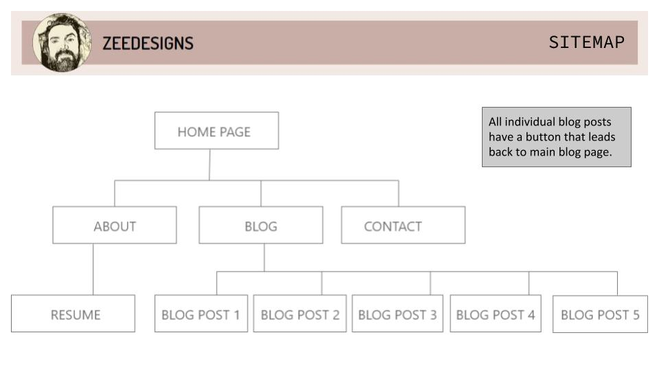

# **T1A2 - Portfolio**

## **Sitelinks**
### [Gordon Campbell's Portfolio site](https://boring-kepler-c32500.netlify.app/)
### [GitHub Repository](https://github.com/mintyjones/Portfolio_site)

---

## **Site Description**

### **PURPOSE**
This portfolio website should deliver information about me which presents me as a Web Development professional targeting employers in the IT industry. It should show creative flair and thoughtful coding, whilst illustrating your personality and accomplishments.

### **FUNCTIONALITY / FEATURES**
- Clean and simple site / minimal text and images, concetrated more on deisgn simplicity and consistency
- Accessibility / 90% pure semantic markup within the HTML keeping in mind accessibility and giving google and other search engines better context when crawling the site
- Accessibility / When developing the mobile nav, a little research shows that alternatives to the hamburger are starting to be preferred, therefore, utilising simple CSS I used semantic icons for the menu items.
- High contrast buttons / Drawing the user's eye to these "Call to Action" buttons
- Muted tones and colours / simple palette and easy on the eye - shades of brown are underrated - only one contrasting colour for making particular items standout
- Styled social platform logos / Again, keeping the design of the site quite muted
- Responsive design / Built with the "mobile first" approach

### **SITEMAP**

### **SCREENSHOTS**

### **TARGET AUDIENCE**
- Prospective employers
- Other IT professionals
- Aspiring Web Developers
- People that enjoy perusing the web

### **TECH STACK** (e.g. html, css, deployment platform, etc)
- HTML
- CSS (transpiled from SCSS)
- Source control through Git
- remote repository through GitHub
- live deployment through Netlify